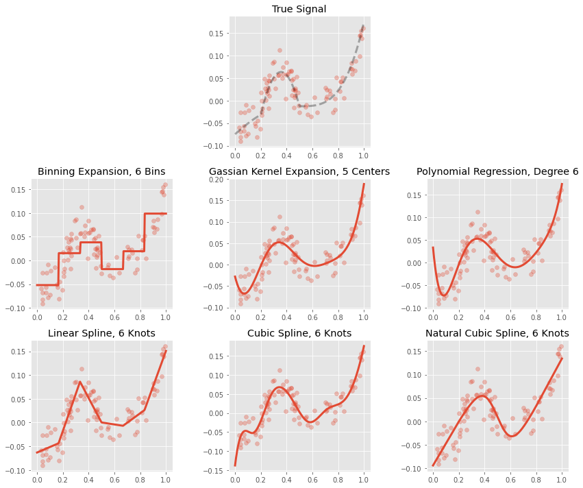

# Basis Expansions

This module includes some scikit-learn style transformers that perform basis expansions on a feature `x` for use in regression. A basis expansions for the feature `x` is
a collection of functions

    f_0, f_1, f_2, ...

that are meant to be applied to the feature to construct derived features in a
regression model.  The functions in the expansions are often chosen to allow
the model to adapt to non-linear shapes in the predictor/response relationship.
When a basis expansion is *applied* to the feature `x`, the result is a new
matrix or data frame of derived features

    f_0(x), f_1(x), f_2(x), ...

## Installation

You can install this library directly from github:

```bash
pip install git+https://github.com/madrury/basis-expansions.git
```

If you would prefer to install from source, first clone this repository:

```bash
git clone https://github.com/madrury/basis-expansions.git
```

And then navigate into the cloned directory, and run `pip install`

```bash
cd basis_expansions
pip install .
```

## Supported Expansions

The following classes are included:

  - `Binner`: Creates indicator variables by segmenting the range of `x` into disjoint intervals.
  - `GaussianKernel`: Create Gaussian Kernel features, also known as "radial basis functions" by people cooler than me.
  - `Polynomial`: Creates polynomial features.  Using these features in a regression fits a polynomial function of a given degree `x` to `y`.
  - `LinearSpline`: Creates a piecewise linear spline which joins continuously at the knots.  Using this in a regression fits a piecewise linear function of `x` to `y`.
  - `CubicSpline`: Creates a piecewise cubic spline which joins continuously, differentiably, and second differentiably at a set of supplied knots.
  - `NaturalCubicSpline`: Creates a piecewise natural cubic spline (cubic curves in the interior segments, linear in the exterior segments) which joins continuously, differentiably, and second differentiably at a set of supplied knots.




## Examples

The most basic use case is to transform a `numpy.array`:

```python
x = np.random.uniform(0, 1, size=10)
pl = LinearSpline(knots=[0.25, 0.75])
pl.fit_transform(x)
```

which results in a two dimensional `array`:

```python
array([[ 0.21776114,  0.        ,  0.        ],
       [ 0.63360478,  0.38360478,  0.        ],
       [ 0.29089787,  0.04089787,  0.        ],
       [ 0.83284663,  0.58284663,  0.08284663],
       [ 0.89158883,  0.64158883,  0.14158883],
       [ 0.97076139,  0.72076139,  0.22076139],
       [ 0.83373019,  0.58373019,  0.08373019],
       [ 0.39301854,  0.14301854,  0.        ],
       [ 0.27773455,  0.02773455,  0.        ],
       [ 0.68772864,  0.43772864,  0.        ]])
```

If we transform a `pandas.Series`:

```python
s = pd.Series(x, name="moshi")
pl = LinearSpline(knots=[0.25, 0.75])
pl.fit_transform(s)
```

the result is a `pandas.DataFrame`:

```python
   moshi_spline_linear  moshi_spline_0  moshi_spline_1
0             0.217761        0.000000        0.000000
1             0.633605        0.383605        0.000000
2             0.290898        0.040898        0.000000
3             0.832847        0.582847        0.082847
4             0.891589        0.641589        0.141589
5             0.970761        0.720761        0.220761
6             0.833730        0.583730        0.083730
7             0.393019        0.143019        0.000000
8             0.277735        0.027735        0.000000
9             0.687729        0.437729        0.000000
```

More advanced use can combine these transformers with `sklearn.pipeline` objects.  For helper classes that allow for transformations on `pandas.DataFrames`, see `examples/dftransformers.py`.


## Examples

See the `basis-expansions-regressions.ipynb` notebook for examples of use.